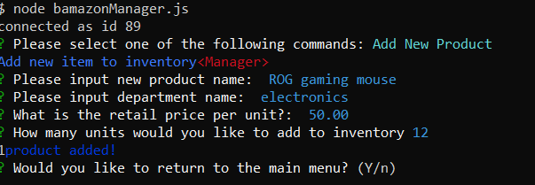

# Bamazon
A node cli app of an amazon-like storefront, utilizing MySQL to handle data.

Bamazon has 3 JS files to run with Node.js, each providing a different set of functions.

## What you will need 

-explanations to follow

1. A code editor, I prefer Visual Studio Code ("https://code.visualstudio.com/").
2. Node.js to run node commands in terminal ("https://nodejs.org/en/download/").
3. '.gitignore' file to write what files you would not like to upload. 
4. NPM packages: 'inquirer', 'mysql', 'chalk'.
5. MySQL downloaded (you will need MySQL workbench) ("https://www.mysql.com/downloads/").


## Lets get set up!

1. Create a project folder (to save time you can clone this repository and skip the steps you don't need.)
    -Create files named:
    - 'bamazonCustomer.js'
    - 'bamazonManager.js'
    - 'bamazonSupervisor.js'
    - '.gitignore'
    - 'bamazonSeeds.sql'

2. In the root of your project folder in terminal and run "npm init -y". This will initialize a "package.json" file for your project. (this is required to install npm packages).

3. Inside your '.gitignore' file add the following line. (this will prevent git from uploading these files).
```
node_modules
```
4. Inside terminal once again Install all  relevant NPM packages via the following command:
    - `$ npm i inquirer`

    - `$ npm i mysql`

    - `$ npm i chalk`

5. Use MySql Workbench to create a database called "bamazon_db" (this can be done with 'bamazonSeeds.sql' too.).

## What should each application do?

### bamazonSeeds.sql

1. Create a MySQL Database called `bamazon_db`.

2. Then create a Table inside of that database called `products`.

3. The products table should have each of the following columns:

   * item_id (unique id for each product)

   * product_name (Name of product)

   * department_name

   * price (cost to customer)

   * stock_quantity (how much of the product is available in stores)

4. Populate this database with around 10 different products. (i.e. Insert "mock" data rows into this database and table).

5. Example:

```
CREATE DATABASE bamazon_db;

USE bamazon_db;

CREATE TABLE products (
    item_id INT NOT NULL AUTO_INCREMENT,
    product_name VARCHAR(50) NOT NULL,
    department_name VARCHAR(30) NOT NULL,
    price DECIMAL (10,2) NOT NULL,
    stock_quantity INTEGER(10),
    PRIMARY KEY (id)
);

INSERT INTO products (product_name, department_name, price, stock_quantity)
VALUES ("Nitro 5 laptop", "electronics", 699.99, 5),
("Kingston SSD-500gb", "electronics", 60.99, 10),
("LG Ultrawide monitor-34", "electronics", 249.99, 3),
("Huggies Dipers size-3 (136ct)", "Babies/toddlers", 45.99, 20),
("Unicorn sleeper (6-9 months)", "Babies/toddlers", 4.99, 15),
("Bright Stars playmat", "Babies/toddlers", 15.99, 5),
("Nerf Ultra 2", "Toys", 23.99, 10),
("Nerf Ultra Darts (100ct)", "Toys", 19.99, 10),
("Snow Pants (small 6-7)", "Boy's clothing", 15.00, 8),
("Minecraft Winter Hat", "Boy's clothing", 9.99, 10),
("Winter Gloves", "Boy's clothing", 12.99, 3)

```

6. This can be written in 'bamazonSeeds.sql' or directly in MySQL Workbench, if using 'bamazonSeeds.sql', simply copy and paste into a new workbench query and run with the 'lightning bolt'.

7. Your database should now be created, with a 'products' table, and populated with values. Later on we will create a new table.

### App: 'bamazonCustomer.js'

#### Purpose 
-Running this application will first display all of the items available for sale. Include the ids, names, and prices of products for sale.


##### Lets create the connection

1. First, use 'require' to make use of the 'mysql' npm package, place this at the top of your file.
```
const mysql = require("mysql");
```
2. Now lets set up the connection. We need to define a 'connection' variable. 

```
var connection = mysql.createConnection({
  host: "localhost",

  // Port
  port: 3306,

  // Username
  user: "userName goes here", // default userName = 'root'

  // Password
  password: "MySQL password goes here",
  database: "bamazon_db"
});
```
3. Now make use of that connection to connect to database:

```
connection.connect(function(err) {
  if (err) throw err;
  console.log("connected as id " + connection.threadId);
  // do something (call a function here). example: showItems()
});
```

4. We are now connected to our database and can now create queries to return database information. Start by calling a function inside our initial connection. Then create a MySQL query and 'console.table' the response to display the response in a table.

```
function showItems() {
  console.log(chalk.blue.bold("Here's whats for sale:"));
  connection.query("SELECT * FROM products", function(err, res) {
    if (err) throw err;
    console.table(res);
    startInquirer(res); // call next function here!!!
  });
};
```

#### What should it do?:

1. The app should then prompt users with two messages.

   * The first should ask them the ID of the product they would like to buy.
   * The second message should ask how many units of the product they would like to buy.

2. Once the customer has placed the order, your application should check if your store has enough of the product to meet the customer's request.

   * If not, the app should log a phrase like `Insufficient quantity!`, and then prevent the order from going through.

3. However, if your store _does_ have enough of the product, you should fulfill the customer's order.
   * This means updating the SQL database to reflect the remaining quantity.
   * Once the update goes through, show the customer the total cost of their purchase.

##### Notes:

-First, once connected, the table will be displayed.

-Then you can make use of inquirer to prompt the user questions (such as "What item would you like to buy?" & "How many would you like to buy?").

-To make use of inquirer (and other npm's) make sure to 'require' it at the top of the file.

```
const inquirer = require("inquirer");
```

-We can use a 'for' loop to check for a match of a 'item_id' entered, and then grab the stock from that item, along with the price, and use conditional statements to determine what to do next.

-Example:
```
// Start prompting user about purchases via inquirer
function startInquirer(res) {
  let itemsArray = res;
  inquirer.prompt([
    {
      type:"input",
      name:"itemSelect",
      message:"Please input the 'item_id' of the item you would like to purchase",
      default: 1
    },
    {
      type:"input",
      name:"itemQuantity",
      message:"How many would you like?",
      default: 1
      
    }
  ]).then(function(response) {
    
    let itemID = response.itemSelect;
    let numOf = response.itemQuantity;

    for (i=0; i< itemsArray.length; i++) {
      
      if (itemID == itemsArray[i].item_id) {
        //console.log("match found! " + itemsArray[i].product_name)
        
        if (numOf <= itemsArray[i].stock_quantity) {
          //console.log("ok, ordering " + numOf + " " + itemsArray[i].product_name )
          quantityLeft = itemsArray[i].stock_quantity - numOf
          total = itemsArray[i].price * numOf
          shoppingCart.push(" " + numOf + " - " + itemsArray[i].product_name);
          shoppingCartTotal.push(total);
          //update(numOf);
        } else {
          console.log(chalk.red("Sorry, quantity of that item is limited. lets try again..." + chalk.red.underline("this time order a bit less...")));
          return showItems();
        };
      };
        
      
    }; // end of for loop
    console.log(chalk.magenta("\n============================================\n"))
    console.log("Shopping cart: " + chalk.yellow.bold(shoppingCart));
    console.log("This adds " + chalk.green(total) + " to your order");
    console.log("total for all items in shopping cart: " + chalk.green.bold.underline(shoppingCartTotal.reduce(addEmUp)));
    console.log(chalk.magenta("\n============================================\n"))

    // update database before asking customer if they want to keep shopping
    update(itemID, quantityLeft, total); // Here we call another function, and pass in the information we need.
  })

}; // END OF startInquirer function
```

-Notice here we end this function by calling another and passing in the variables we defined. 

-You may have also noticed we used the'.reduce()' method to add the items in the 'shoppingCartTotal' array and passed in a function we call 'addEmUp()'.

-Here's an example of 'addEmUp()' :
```
function addEmUp (total, num) {
  return total + num;
}; // END OF addEmUp function
```

-Now we need to update the inventory

```
// Update MySQL database
function update(itemID, quantityLeft, total) {
  console.log(chalk.blue("\nUpdating quantities...\n"));
  connection.query(
    "UPDATE products SET ? WHERE ?",
    [
      {
        stock_quantity: quantityLeft,
        product_sales: total
      },
      {
       item_id: itemID
      }
    ], 
    function(err, res) {
      if (err) throw err;
      console.log(res.affectedRows + chalk.blue(" products updated!\n"));
      keepShopping();
    }
  );
}; // END OF update function

```

-Then we end this function by calling the 'keepShopping()' function, which is another inquirer prompt with a simple yes or no return.

```
// Prompt the user to see if they would like to keep shopping
function keepShopping() {
  inquirer.prompt([
    {
      type:"confirm",
      name:"confirm",
      message:"Would you like to keep shopping?"
    }
  ]).then(function(response) {
    if (response.confirm === true) {
      showItems();
    } else {
      getShipping();
    }

  });
}; // END OF keepShopping function

```

-If the user wants to keep shopping, then we call 'showItems()' all over again (recursion). else we call 'getShipping()' and make use of inquirer to grab the customers shipping info, and shipping cost and display the total with shipping included and shipping address as entered.

```
// A function to grab user shipping info, shipping cost, and display, then end the connection (checkout if you will)
function getShipping() {
  inquirer.prompt([
    {
      type:"input",
      name:"users-name",
      message:"What is your full name?",
      validate: function(value) {
        if (value == "") {
            return "Please enter your full name"

        } else {
            return true
        }
     }
    },
    {
      type:"input",
      name:"street-address",
      message:"What is your street address?",
      validate: function(value) {
        if (value == "") {
            return "Please enter your street address"

        } else {
            return true
        }
     }
    },
    {
      type:"input",
      name:"city",
      message:"What city do you live in?",
      validate: function(value) {
        if (value == "") {
            return "Please enter your city"

        } else {
            return true
        }
     }
    },
    {
      type:"input",
      name:"state",
      message:"What state do you live in? (initials)",
      validate: function(value) {
        if (value == "") {
            return "Please enter your state (initial)"

        } else {
            return true
        }
     }
    },
    {
      type:"input",
      name:"zip",
      message:"Please enter your zip code",
      validate: function(value) {
        if (value == "") {
            return "Please enter your zip code"

        } else {
            return true
        }
     }
    },
    {
      type:"list",
      name:"shipping",
      message:"Please select a shipping option: Overnight = $100, 2-3 days = $30, 5-6 days = $15",
      choices:[100, 30, 15],
    }
  ]).then(function(response){
    let name = response["users-name"];
    let street = response["street-address"];
    let city = response.city;
    let state = response.state;
    let zip = response.zip;
    let shipping = response.shipping;
    shoppingCartTotal.push(shipping);

    let shippingAddress = [
      "---------------------\n",
      name,
      street,
      city + ", " + state + " " + zip,
      "---------------------\n"
    ].join("\n\n")

    console.log(chalk.magenta("\n============================================\n"))
      console.log("\n" + chalk.blue.bold("Thanks for shopping with us!") + "\n")
      console.log("Today you purchased: " + chalk.yellow.bold(shoppingCart));
      console.log("The total for these purchases with shipping: " + chalk.green.bold.underline(shoppingCartTotal.reduce(addEmUp)));
      console.log(chalk.cyan("Shipping to: \n") + chalk.magenta(shippingAddress));
      console.log("\n" + chalk.blue.bold("Come back soon!"));
      console.log(chalk.magenta("\n============================================\n"))
      connection.end();

  })
}; // END OF getShipping function.

```
-Note that we use chalk to add styling to console log's, simply require 'chalk' like the other npm's and use as desired. For more information on 'chalk' please see ("https://www.npmjs.com/package/chalk").

##### A visual example of cli in operation

-First run 'bamazonCustomer.js' with node to display the database table 'products' and start inquirer prompt.


-Then enter the 'item_id' and 'quantity' you would like to buy. The results will be logged and the user will be prompted if they would like to keep shopping.


-When selecting yes, 'showItems()' will run, repeating step 1.


-After selecting a new item and quantity, the shopping cart , total for new order, and total for all items in the cart will be logged, database updated, and the user prompted if they would like to keep shopping.


-When the user decides they don't want to keep shopping, 'getShipping()' will run, prompting the user for their shipping info, and shipping option.


-After the user enters the shipping information and selects their option, the results will be logged, the shipping cost will be added to the total cost, and the connection will end.


### App: 'bamazonManager.js'

#### Purpose 

-Provide a menu of commands for the manager to run.

* List a set of menu options:

    * View Products for Sale
    
    * View Low Inventory
    
    * Add to Inventory
    
    * Add New Product

#### What should it do?:

-Here's what each command should do:

  * If a manager selects `View Products for Sale`, the app should list every available item: the item IDs, names, prices, and quantities.

  * If a manager selects `View Low Inventory`, then it should list all items with an inventory count lower than five.

  * If a manager selects `Add to Inventory`, your app should display a prompt that will let the manager "add more" of any item currently in the store.

  * If a manager selects `Add New Product`, it should allow the manager to add a completely new product to the store.


##### Notes:

-You can simply copy and past the required modules, the connection variable and the connection function from 'bamazonCustomer.js'.
```
// NPM packages
const inquirer = require("inquirer");
const mysql = require("mysql");
const chalk = require('chalk');

//global variables


// Setting up mysql connection 
var connection = mysql.createConnection({
    host: "localhost",
  
    // Port
    port: 3306,
  
    // Username
    user: "bauter",
  
    // Password
    password: "raspberry3.14",
    database: "bamazon_db"
  });
  
  // mysql connection function
  connection.connect(function(err) {
    if (err) throw err;
    console.log("connected as id " + connection.threadId);
    //do something (call menu function)
    menu();
  });
```
-Next we call the menu function, this users inquirer to offer a list of  choices of the menu functions, the response is the assigned to a variable and passed into the next function call ('runCommand()'). This function contains a switch statement that is then used to determine which function to run next. If user choses 'exit' the connection is ended.

```
 function menu() {
      inquirer.prompt([
          {
              type:"list",
              name:"menu-options",
              message:"Please select one of the following commands:",
              choices:[chalk.green.bold("View Products for Sale"), chalk.yellow.bold("View Low Inventory"), chalk.magenta.bold("Add to Inventory"), chalk.cyan.bold("Add New Product"), chalk.red.bold("Exit")]
          }
      ]).then(function(response) {
        // Assign the response to a variable.
        let command = response["menu-options"];
        runCommand(command);
        
        //connection.end();

      });


  } // END OF menu function

  // A function to execute the command from menu.
  function runCommand(commandInput) {
    
    switch (commandInput) {
        case chalk.green.bold("View Products for Sale"):
            // do something (call function here)
            viewForSale();
            break;

        case chalk.yellow.bold("View Low Inventory"):
            // do something (call function here)
            viewLowInv();
            break;

        case chalk.magenta.bold("Add to Inventory"):
            // do something (call function here)
            addToInv();
            break;

        case chalk.cyan.bold("Add New Product"):
            // do something (call function here)
            addNewItem();
            break;

        case chalk.red.bold("Exit"):
            connection.end();
            process.exit;
            break;

        default:
            break;
    };

  }; // END OF runCommand function
```

#### Each function inside 'runCommand()'

##### "View Products for Sale"/viewForSale()

-This function simply creates a connection query to display("SELECT") all(" * ") columns "FROM" the 'products' table, just like we did in 'bamazonCustomer.js'.

```
function viewForSale() {

    console.log(chalk.blue.bold("Here's whats for sale: ") + chalk.red.dim("<Manager>"));

    connection.query("SELECT * FROM products", function(err, res) {
        if (err) throw err;
        console.table(res);
        // do something
        returnTo();
    });

}; // END OF viewForSale function
```

##### "View Low Inventory"/viewLowInv()

-This function creates a new connection query and displays("SELECT") all items "FROM" 'products' table "WHERE" 'stock_quantity' is less than 5.

```
function viewLowInv() {
    console.log(chalk.blue.bold("These items are getting low: ") + chalk.red.dim("<Manager>"));

    connection.query("SELECT * FROM products WHERE stock_quantity <= 5",function(err, res) {
        if (err) throw err;
        console.table(res);
        // do something
        returnTo();
    });

}; // END OF viewLow function
```

##### "Add to Inventory"/addToInv()

-This function uses inquirer prompt to ask the user which item they would like to update and how many. We make use of a 'for' loop (just like in 'bamazonCustomer.js') to match the inquirer response to an item in the table, then we create a new connection query where we "UPDATE" the product by the 'item_id' and "SET" the new stock number (new stock number is the stock we would like to add plus the current stock).

```
// A function to "Add to Inventory". connection is made to database
function addToInv() {
    console.log(chalk.blue.bold("Add to inventory") + chalk.red.dim("<Manger>"));


    connection.query("SELECT item_id, product_name, stock_quantity FROM products",function(err, res) {
        if (err) throw err;

        console.table(res);
        
        inquirer.prompt([
            {
                type:"input",
                name:"id",
                message:"Which product would you like to update? (please use 'item_id')"
            },
            {
                type:"input",
                name:"num",
                message:"How many units would you like to add to stock?"
            }
        ]).then(function(response) {
            let id = response.id;
            let numToAdd = response.num;
            let itemsArray = res;
            let currentStock;
            let newStock;
            for (i = 0; i< itemsArray.length; i++) {
                if (id == itemsArray[i].item_id) {
                    currentStock = itemsArray[i].stock_quantity;
                    newStock = +numToAdd + +currentStock;
                };
                
            };
            console.log(newStock)
            connection.query("UPDATE products SET ? WHERE ?",
            [
                {
                    stock_quantity: newStock
                },
                {
                    item_id: id
                }
            ],
            function(err, res) {
                if (err) throw err;
                console.log(res.affectedRows + " product updated");
                returnTo();
                
            })
    
        })
    
    });

}; // END OF addToInv function
```

##### "Add New Product"/addNewItem()

-This function uses inquirer to prompt the user to enter the new product info, then grabs those responses, and assigns them to variables.n Then a new connection query is created where we "INSERT INTO" the 'products' table and "SET" the new values.

```
// A function to "Add New Product". connection is made to database
function addNewItem() {
    console.log(chalk.blue.bold("Add new item to inventory") + chalk.red.dim("<Manager>"));

    // run inquirer to find and store customer input
    inquirer.prompt([
        {
            type:"input",
            name:"product-name",
            message:"Please input new product name: "
        },
        {
            type:"input",
            name:"department-name",
            message:"Please input department name: "
        },
        {
            type:"input",
            name:"price",
            message:"What is the retail price per unit?: "
        },
        {
            type:"input",
            name:"quantity",
            message:"How many units would you like to add to inventory"
        }
    ]).then(function(response) {
        let productName = response["product-name"];
        let departmentName = response["department-name"];
        let price = response.price;
        let setQuantity = response.quantity;

        connection.query("INSERT INTO products SET?",
        {
           product_name: productName,
           department_name: departmentName,
           price: price,
           stock_quantity: setQuantity, 
        },
        function(err, res) {
        if (err) throw err;
        
        console.log(res.affectedRows + chalk.blue("product added!"));
        returnTo();
        })
    })

}; // END OF addNewItem
```

##### Add. notes

-You will notice each function ends by calling the 'returnTo()' function. This function simply uses inquirer to prompt the user if they would like to return to the menu or not. If they do, 'menu()' is called, else the connection is ended'

```
// A function to prompt the user if they would like to return to main menu or sever the connection.
function returnTo() {
    inquirer.prompt([
        {
            type:"confirm",
            name:"return",
            message:"Would you like to return to the main menu?"
        }
    ]).then(function(response) {
        if (response.return) {
            console.log(chalk.blue("returning to main menu"));
            menu()
        } else {
            console.log(chalk.blue("\n\nGoodbye\n\n"));
            connection.end();
        }
    }) 
}; // END OF returnTo function
```

##### A visual example of cli in operation

 * MENU

 

 * "View Low Inventory"

 

 * "View Low Inventory"

 

 * "Add to Inventory"

 

    * Now display products again to see the change

 

 * "Add New Product"

 

    * Now display products again to see the change

 


